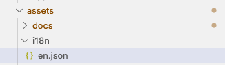
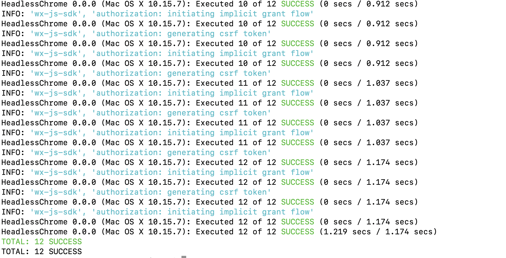
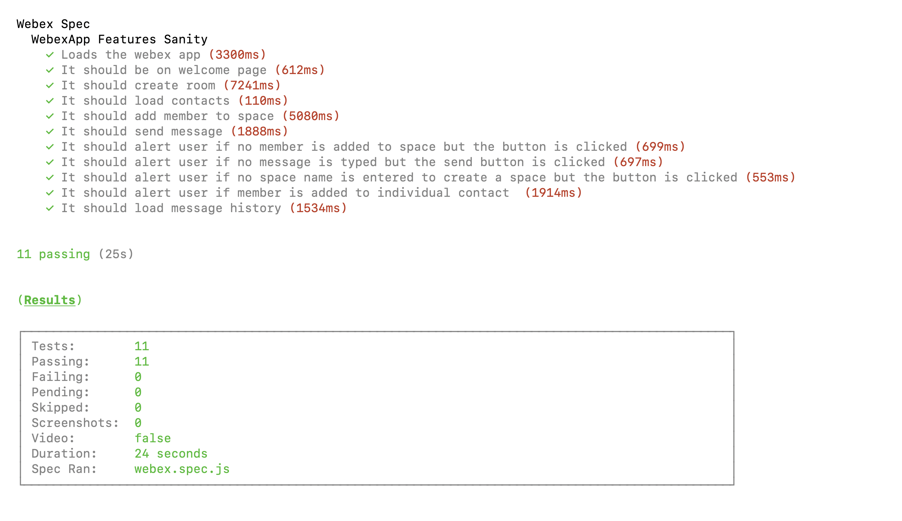
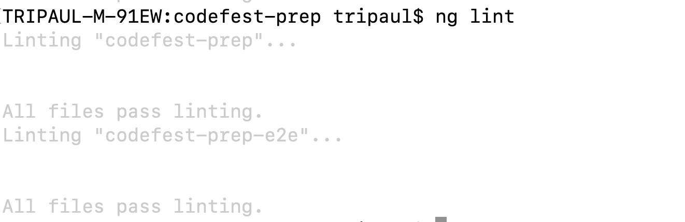

# WebexApp

The project is created as a part of Codefest 2021 Preparatory task. It is a simple app created with Webex SDKs which allows the user to do the following:
* [Login to webex](src/assets/docs/login/README.md)
* [Create a webex space/room](src/assets/docs/createroom/README.md)
* [Add memeber to space](src/assets/docs/addmember/README.md)
* [Send a message to your contact](src/assets/docs/sendmessage/README.md)
* [Load message history](src/assets/docs/loadmessage/README.md)
* [Logout](src/assets/docs/logout/README.md)

## Technologies Overview

This project is built using Angular (7.x), [Momentum UI](https://momentum.design/components/overview) & [Webex SDKs](https://developer.webex.com/docs/sdks/browser).

## Setup

Run `npm install` to install the dependencies.

### Development server

Run `ng serve` for a dev server. Navigate to `http://localhost:4200/`. The app will automatically reload if you change any of the source files.

## Code scaffolding

Run `ng generate component component-name` to generate a new component. You can also use `ng generate directive|pipe|service|class|guard|interface|enum|module`.

Run `ng generate service service-name` to generate a new service.

## Localisation/Internationalisation

The webapp supports [Internalization](http://www.ngx-translate.com/), currently English(en) has been set as the default language. Going forward we can invlove other languages by adding json files with the translated words under `assets/i18n` folder.

    

## Build

Run `ng build` to build the project. The build artifacts will be stored in the `dist/` directory. Use the `--prod` flag for a production build.

## Testing Info

### Unit tests

Run `ng test` to execute the unit tests via [Karma](https://karma-runner.github.io).

    

### End-to-End tests

Run `cypress run --config screenshotOnRunFailure=false,video=false --env access_token=<your access token>` to execute the end-to-end tests in headless mode via [Cypress](https://www.cypress.io/).

    

The E2E tests verify the following functionalities : 
* Loads the webex app with the access token provided by the user
* After succesful login it should land up in the welcome page
* Creates a space - `my test room`
* Loads the contacts for the user
* Adds a test member `test@c.com` to the space `my test room`
* Sends `Hello !` message to the space `my test room`
* Verifies alert message if no member is added to space but `Add Member` button is clicked
* Verifies alert message if no message is typed but the `Send` button is clicked
* Verifies alert message if no space name is entered to create a space but the `Create Room` button is clicked
* Verifies alert message if member is added to individual contact
* Verifies the message history in `my test room` space

## Code styling

### Lint checks

Run `ng lint` to check if there is any lint failures

    

## Logging

[NGX Logger](https://www.npmjs.com/package/ngx-logger) has been used as the logging module for angular webapp. It allows "pretty print" to the console, as well as allowing log messages to be POSTed to a URL(`/api/logs`) for server-side logging.

## Error handling

Proper checks are made to catch the error scenarios while invoking webex SDKs. If there is some error, the same is logged using [NGX Logger](https://www.npmjs.com/package/ngx-logger) & the user is alerted with appropriate message in the dialog box.

## Further help

* To get more help on the Angular CLI use `ng help` or go check out the [Angular CLI README](https://github.com/angular/angular-cli/blob/master/README.md).
