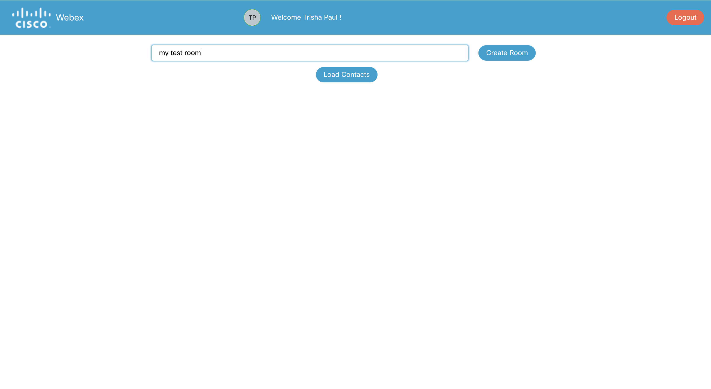
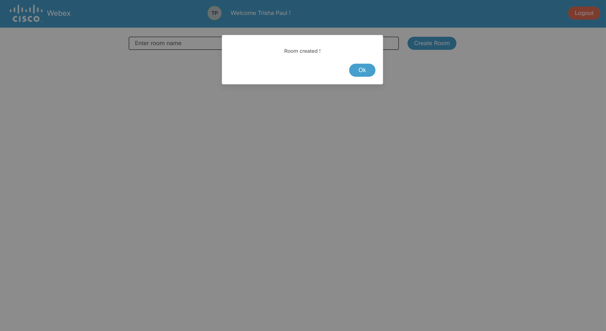

## Create a webex space/room

To create a webex space/room from the WebexApp, enter the room name and click on the `Create Room` button as shown in the screenshot below.

    

Once the room is created, a dialog box pops up with the message of confirmation.

    

Click on the `Ok` button of the dialog box to go back to the main page

If you click on the `Create Room` button without entering room name in the input box an alert dialog box pops up on the screen

    

