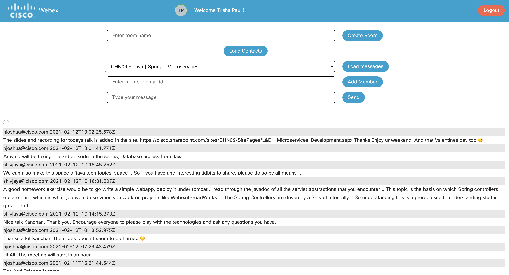
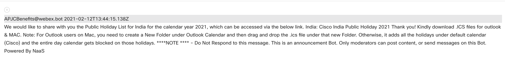

## Load message history

To load message history of your contacts, click on the `Load Contacts` button if the contacts menu and the load message button is not displayed.

    

The loader spins up as the contact details are fetched

    

Once the contact details are fetched, the menu displays all the contacts as shown in the screenshot below

    

Select the contact person or the space for which you wish to load the messages and click on the `Load messages` button

    

To close the chat history panel click on the close-space button

    

