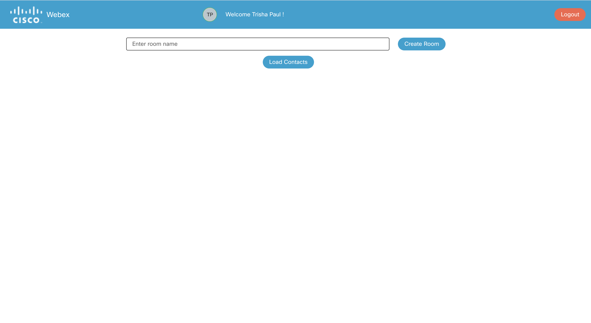

## Login to webex

To login to the WebexApp use your cec credentials as shown in the screenshot below.

    

After successful login, the welcome message is displayed as show below

    

Click on the `Ok` button of the dialog box and in the header menu, the logged in **user name** and the **avatar** with the initails is shown

    

