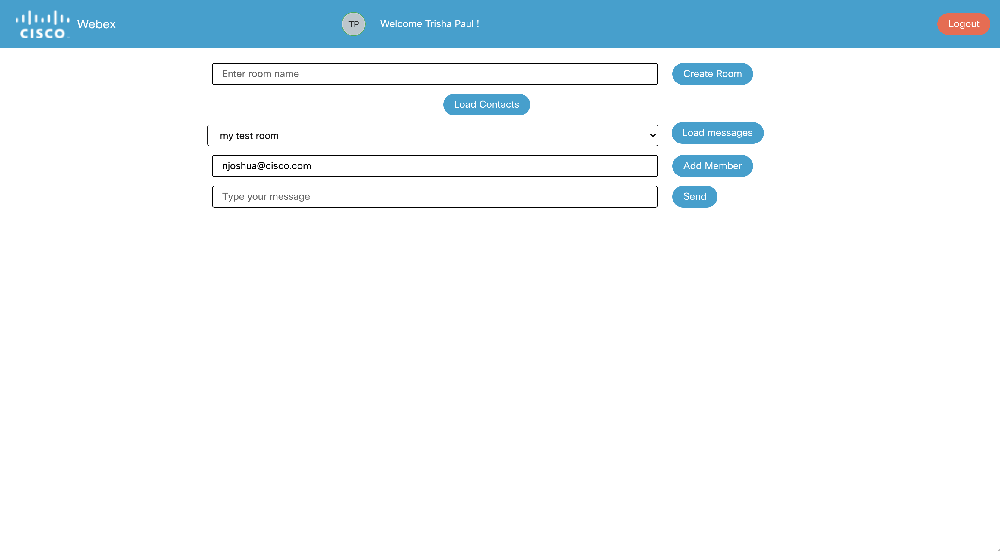
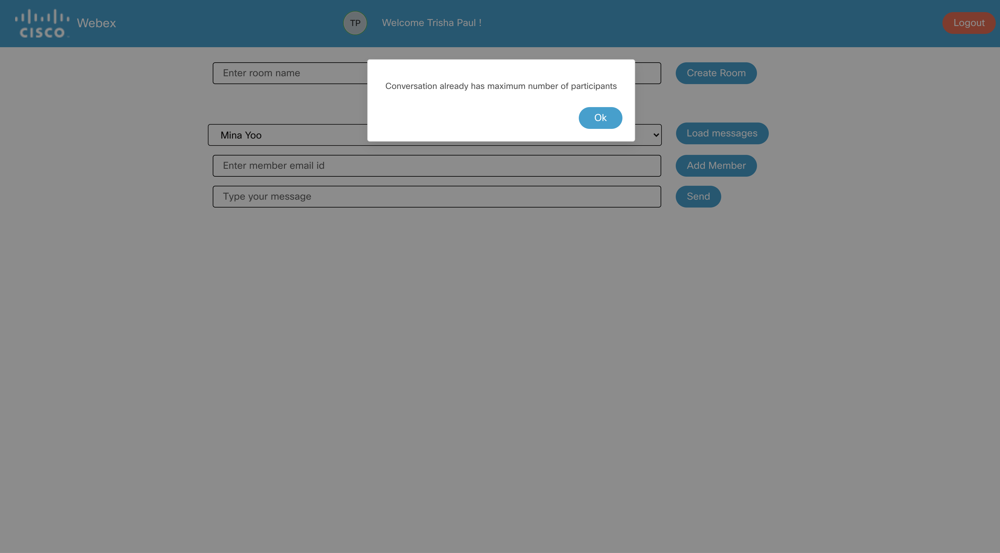

## Add memeber to space

To add a member to a space, click on the `Load Contacts` button if the contacts menu and the add member input box is not displayed.

    

The loader spins up as the contact details are fetched

    

Once the contact details are fetched, the menu displays all the contacts as shown in the screenshot below

    

Select the space where you wish to add a new member and enter the member email id in the input box and click on the `Add Member` button.

    

Once the member is added, a dialog box pops up with the message of confirmation.

    

Click on the `Ok` button of the dialog box to go back to the main page

If you click on the `Add Member` button without entering any email id in the input box an alert dialog box pops up on the screen

    

If you are trying to add member to 1:1 contact space an alert dialog box pops up on the screen as member cannot be added to a 1:1 contact

    

If there is any invalid input entered in the add member input box an alert dialog box pops up on the screen

    

