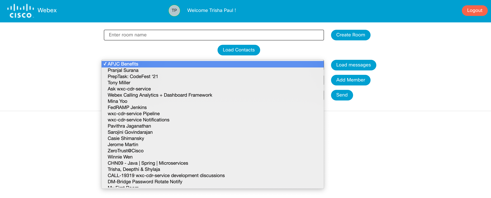
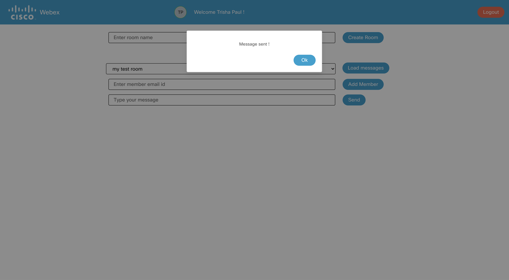

## Send a message to your contact

To send a message to your contacts, click on the `Load Contacts` button if the contacts menu and the send message input box is not dispalyed.

    

The loader spins up as the contact details are fetched

    

Once the contact details are fetched, the menu displays all the contacts as shown in the screenshot below

    

Select the contact person or the space where you wish to send the message and type the message in the message input box and click on the `Send` button.

    

Once the message is sent, a dialog box pops up with the message of confirmation.

    

Click on the `Ok` button of the dialog box to go back to the main page

If you click on the `Send` button without typing any message in the input box an alert dialog box pops up on the screen

    

